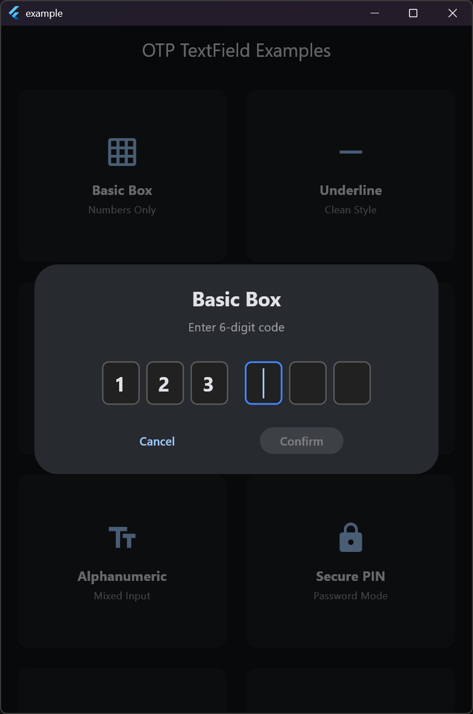
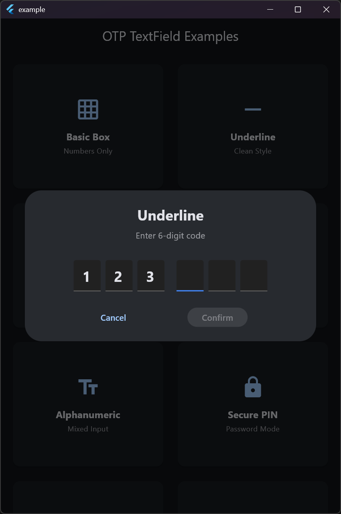
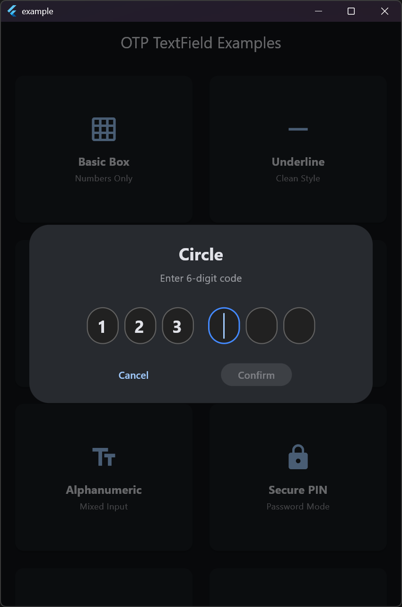
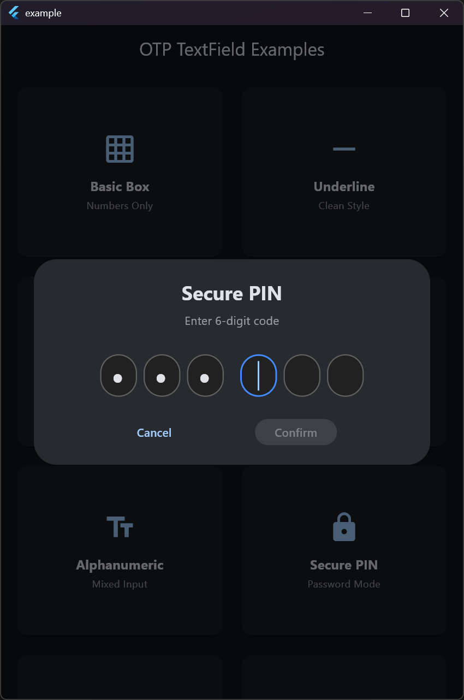
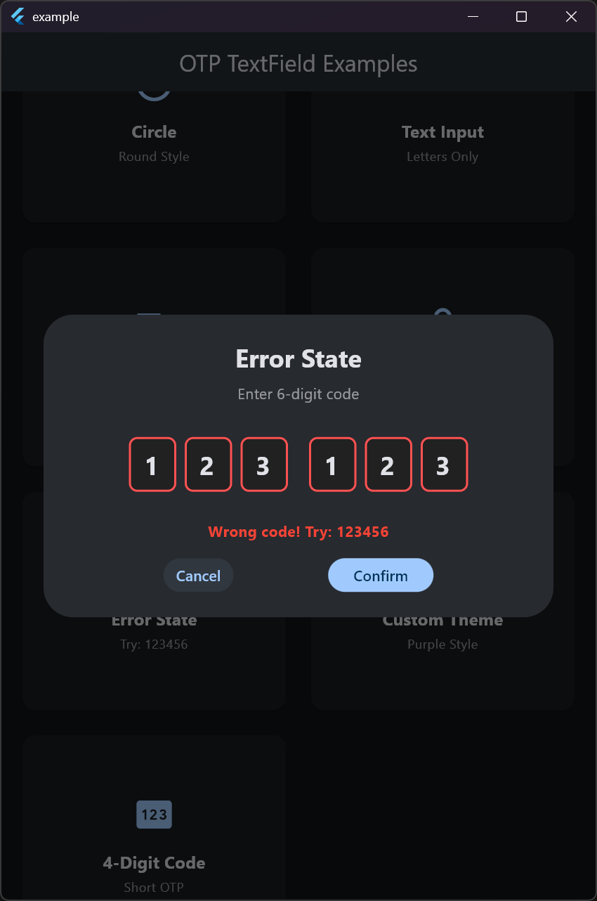

# Flutter OTP TextField

A highly customizable OTP (One-Time Password) text field widget for Flutter with support for multiple styles, themes, and input types.

## Features

✨ **Multiple Field Styles**
- Box (default) - Traditional bordered boxes
- Underline - Minimalist underlined fields
- Circle - Circular PIN-style fields

🎨 **Flexible Theming**
- Light and dark theme presets
- Fully customizable colors and dimensions
- Automatic theme adaptation

⌨️ **Input Type Control**
- Numbers only (default)
- Text only (letters)
- Alphanumeric (mixed)

🔒 **Secure Input**
- Password/PIN mode with obscured text
- Customizable obscuring character

🎯 **State Management**
- Error state styling
- Disabled state
- Auto-focus support
- Focus and change callbacks

⚡ **Smart Navigation**
- Auto-advance to next field
- Backspace to previous field
- Arrow key navigation
- Automatic completion detection

## Screenshots

<table>
  <tr>
    <td align="center">
      <br/>
      <b>Box Style</b>
    </td>
    <td align="center">
      <br/>
      <b>Underline Style</b>
    </td>
    <td align="center">
      <br/>
      <b>Circle Style</b>
    </td>
  </tr>
  <tr>
    <td align="center">
      <br/>
      <b>Secure PIN Entry</b>
    </td>
    <td align="center">
      <br/>
      <b>Error State</b>
    </td>
    <td></td>
  </tr>
</table>

## Installation

Add this to your package's `pubspec.yaml` file:

```yaml
dependencies:
  flutter_otp_widget: ^1.0.0
```

Then run:

```bash
flutter pub get
```

## Basic Usage

```dart
import 'package:flutter_otp_widget/flutter_otp_widget.dart';

class OTPScreen extends StatefulWidget {
  @override
  _OTPScreenState createState() => _OTPScreenState();
}

class _OTPScreenState extends State<OTPScreen> {
  final controllers = List.generate(6, (_) => TextEditingController());
  final focusNodes = List.generate(6, (_) => FocusNode());

  @override
  void dispose() {
    for (var controller in controllers) {
      controller.dispose();
    }
    for (var node in focusNodes) {
      node.dispose();
    }
    super.dispose();
  }

  @override
  Widget build(BuildContext context) {
    return Scaffold(
      body: Center(
        child: OTPTextField(
          controllers: controllers,
          focusNodes: focusNodes,
          textStyle: TextStyle(fontSize: 24, fontWeight: FontWeight.bold),
          onCompleted: (otp) {
            print('OTP Entered: $otp');
            // Verify OTP
          },
          onChange: (value) {
            print('Current OTP: $value');
          },
        ),
      ),
    );
  }
}
```

## Examples

### Different Styles

```dart
// Box Style (Default)
OTPTextField(
  controllers: controllers,
  focusNodes: focusNodes,
  fieldStyle: OTPFieldStyle.box,
  textStyle: TextStyle(fontSize: 24),
)

// Underline Style
OTPTextField(
  controllers: controllers,
  focusNodes: focusNodes,
  fieldStyle: OTPFieldStyle.underline,
  textStyle: TextStyle(fontSize: 24),
)

// Circle Style
OTPTextField(
  controllers: controllers,
  focusNodes: focusNodes,
  fieldStyle: OTPFieldStyle.circle,
  textStyle: TextStyle(fontSize: 24),
)
```

### Custom Theme

```dart
OTPTextField(
  controllers: controllers,
  focusNodes: focusNodes,
  theme: OTPTheme.custom(
    borderColor: Colors.grey,
    focusedBorderColor: Colors.blue,
    errorBorderColor: Colors.red,
    fillColor: Colors.white,
    borderRadius: BorderRadius.circular(12),
  ),
  textStyle: TextStyle(fontSize: 24),
)
```

### Text Input

```dart
OTPTextField(
  controllers: controllers,
  focusNodes: focusNodes,
  inputType: OTPInputType.text,
  textCapitalization: TextCapitalization.characters,
  textStyle: TextStyle(fontSize: 24),
)
```

### Secure PIN Entry

```dart
OTPTextField(
  controllers: controllers,
  focusNodes: focusNodes,
  fieldStyle: OTPFieldStyle.circle,
  obscureText: true,
  obscuringCharacter: '●',
  textStyle: TextStyle(fontSize: 24),
)
```

### Error State

```dart
OTPTextField(
  controllers: controllers,
  focusNodes: focusNodes,
  hasError: isWrongOTP,
  theme: OTPTheme.light().copyWith(
    errorBorderColor: Colors.red,
  ),
  textStyle: TextStyle(fontSize: 24),
)
```

### 4-Digit Code

```dart
final controllers = List.generate(4, (_) => TextEditingController());
final focusNodes = List.generate(4, (_) => FocusNode());

OTPTextField(
  controllers: controllers,
  focusNodes: focusNodes,
  fieldStyle: OTPFieldStyle.underline,
  textStyle: TextStyle(fontSize: 24),
)
```

### With Center Spacing (3-3 Layout)

```dart
OTPTextField(
  controllers: controllers, // 6 controllers
  focusNodes: focusNodes,
  centerSpacing: 16, // Extra space in the middle
  textStyle: TextStyle(fontSize: 24),
)
// Layout: XXX   XXX
```

## Parameters

### OTPTextField

| Parameter | Type | Default | Description |
|-----------|------|---------|-------------|
| `controllers` | `List<TextEditingController>` | required | Text controllers for each field |
| `focusNodes` | `List<FocusNode>` | required | Focus nodes for each field |
| `textStyle` | `TextStyle` | required | Text style for input |
| `onCompleted` | `ValueChanged<String>?` | null | Callback when all fields are filled |
| `onChange` | `ValueChanged<String>?` | null | Callback when any field changes |
| `fieldWidth` | `double` | 40 | Width of each field |
| `fieldHeight` | `double` | 50 | Height of each field |
| `fieldSpacing` | `double` | 8 | Spacing between fields |
| `centerSpacing` | `double?` | null | Extra spacing at the middle |
| `theme` | `OTPTheme?` | null | Theme configuration |
| `fieldStyle` | `OTPFieldStyle` | box | Visual style of fields |
| `inputType` | `OTPInputType` | number | Type of input allowed |
| `obscureText` | `bool` | false | Whether to obscure text |
| `obscuringCharacter` | `String` | '●' | Character for obscuring |
| `enabled` | `bool` | true | Whether fields are enabled |
| `autoFocus` | `bool` | false | Auto-focus first field |
| `hasError` | `bool` | false | Show error state |
| `textCapitalization` | `TextCapitalization` | none | Text capitalization mode |

See the [API documentation](https://pub.dev/documentation/flutter_otp_textfield/latest/) for complete parameter list.

## State Management Integration

The package works seamlessly with any state management solution. Here's an example with Riverpod:

```dart
@riverpod
class OtpControllers extends _$OtpControllers {
  @override
  List<TextEditingController> build(int count) {
    final controllers = List.generate(count, (_) => TextEditingController());

    ref.onDispose(() {
      for (var controller in controllers) {
        controller.dispose();
      }
    });

    return controllers;
  }

  void clear() {
    for (var controller in state) {
      controller.clear();
    }
  }
}

// Usage
final controllers = ref.watch(otpControllersProvider(6));
```

## Contributing

Contributions are welcome! Please feel free to submit a Pull Request.

## License

This project is licensed under the MIT License - see the LICENSE file for details.

## Issues and Feedback

Please file issues, bugs, or feature requests in our [issue tracker](https://github.com/yourusername/flutter_otp_widget/issues).

## Example App

For a complete example with all features demonstrated, check out the [example](example/) directory.
